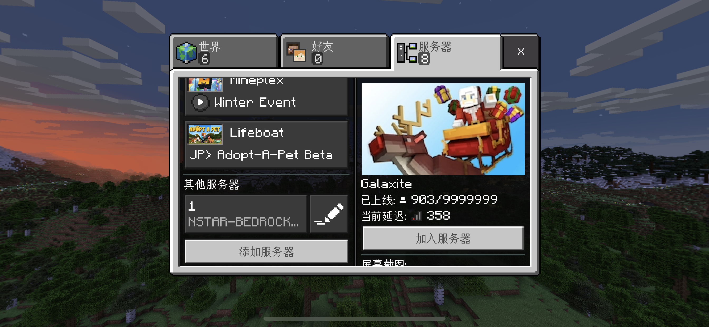

# 使用基岩版加入游戏

## 首先

你得拥有一个基岩版（这不是废话？）

::: tip 基岩版获取方法

**Windows10/11版本**：自己去Windows store买，71RMB

（或者某宝好像有30来块钱的激活码）

**安卓版**：自己去Google Play商店购买

（或者群文件有能用的捏）

**IOS（苹果）版**：使用非大陆的Apple ID登录AppStore，购买并下载

（或者某宝）

:::

## 进入服务器

进入“服务器”页面

点击添加服务器，输入服务器地址和端口

::: tip 基岩版服务器地址

（服务器暂未开放）

服务器名称：你爱咋写咋写

地址：

端口：

:::

然后加入服务器即可

进入后，选择“Mojang账户”登录

然后，输入服务器专用验证系统上的账户和密码即可！（切记，不是输入正版账户！）

::: warning 注意

你不能Java版和基岩版同时登陆

（不信？自己去试试咯）

:::

::: danger 警告

请不要在该服务器使用正版账户登录

否则导致uuid规则不一样和无法和Java版本账户同步

如有该数据，我们会进行删除和封禁

（在服务器中登录正版账户你的id前会有一个*号的）

:::