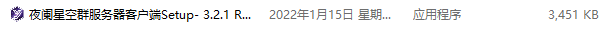
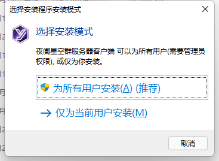
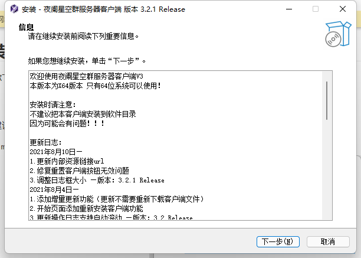
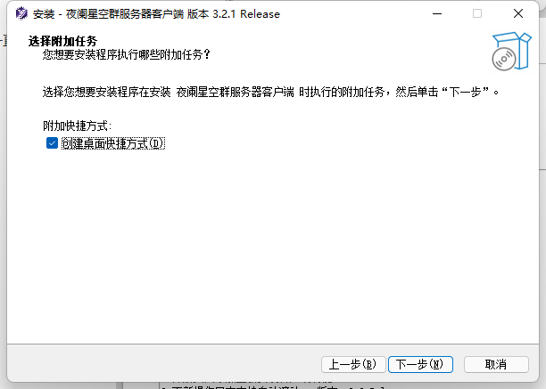
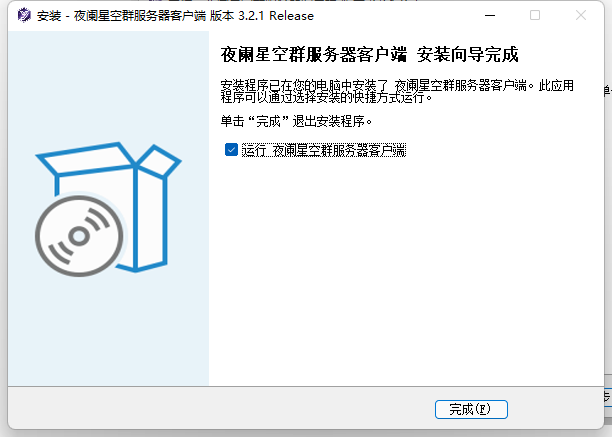
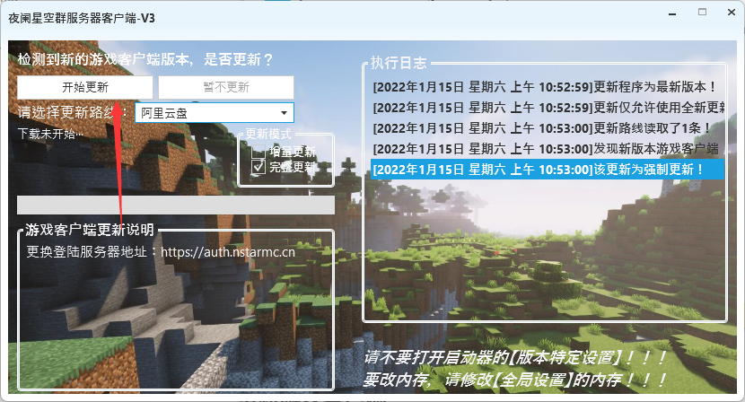
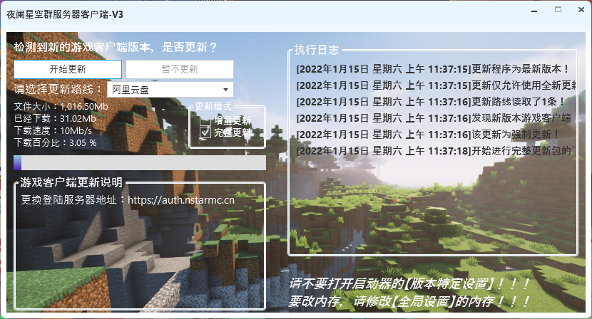
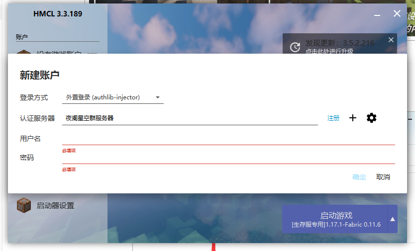
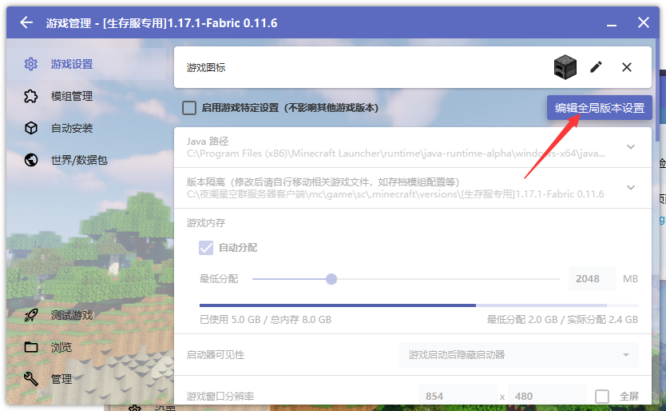
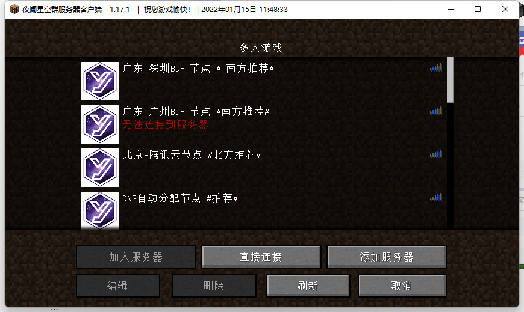

# 使用Java版本进入服务器

::: tip 提示

本篇写的是使用群服务器专用客户端加入教程！

这是最简单的方法！

:::

## 下载群服务器客户端

首先进入群文件，找到“群服务器客户端”文件夹

下载带有“setup”字样的安装包

## 安装群服务客户端

找到你下载的文件，并双击运行

这里建议选择为所有用户安装

然后一直下一步就好了，你可以修改安装目录，客户端大概占用3g的样子

在建议创建快捷方式，然后安装就好

## 运行客户端

### 打开客户端

在安装完成后，可以直接运行，也可在桌面上找到群服务器客户端的快捷方式运行

::: tip 提示

如果运行时弹出错误，请在群文件下载运行库，并安装

然后再次尝试运行

如果还是出错，可以在群里求助

:::

### 更新游戏客户端

第一次启动后会提示需要更新，点击确定后，来到更新页面

点击更新就好，一般不需要调下载路线

然后等待下载完成

下载完成后，程序会使用内置zip扩展对更新包解压，等待即可

### 启动游戏客户端

更新完成后，会显示以下界面，

选择客户端，然后点击启动即可

然后在启动器中输入你的登录验证系统的账户密码进行登录

启动游戏即可

::: warning 修改内存的注意

如果需要修改内存，请按照以下步骤来

点版本这里

点击“编辑全局设置”，千万别勾选版本特定设置！

然后就可以修改内存了

:::

进入游戏后，进入多人游戏就可以看见服务器列表了

::: tip 提示

服务器列表在每次启动时都会更新服务器节点列表

上面图片就不必在意啦~

:::